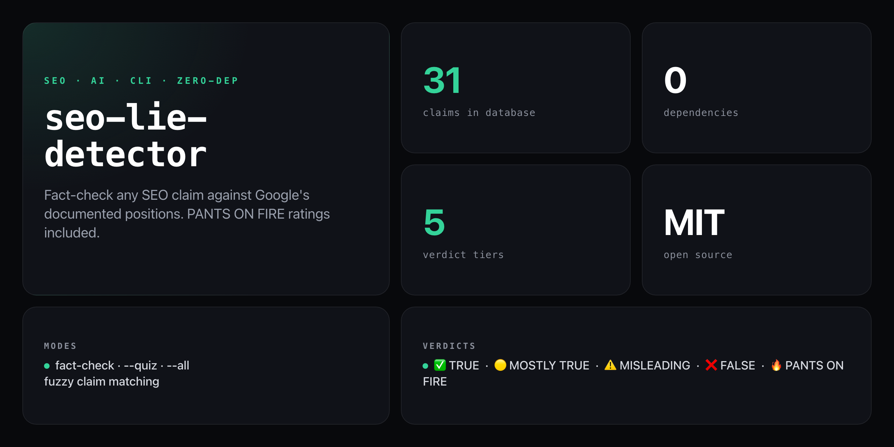

<div align="center">

**Paste in any SEO claim. Get a verdict backed by Google's own documentation — not agency blogs.**


</div>

---

SEO is full of myths recycled by agencies charging £5k/month. This tool maps your claim against 31 fact-checked positions sourced from Google Search Central, confirmed statements from Google engineers, and documented algorithm updates — then returns a verdict with explanation and source.

```
  SEO LIE DETECTOR
  ━━━━━━━━━━━━━━━━━━━━━━━━━━━━━━━━━━━━━━━━━━━━━━━━━━━━━━━━━━━━

  Claim: "meta keywords boost rankings"

  🔥 PANTS ON FIRE — Egregiously wrong. Run.

  Google stopped using the meta keywords tag in September
  2009. Matt Cutts confirmed this publicly. Using it won't
  hurt you, but it won't help either.

  Source: Google Webmaster Blog, Sept 2009

  ━━━━━━━━━━━━━━━━━━━━━━━━━━━━━━━━━━━━━━━━━━━━━━━━━━━━━━━━━━━━
```

## Install

No install required — runs straight from GitHub with zero dependencies:

```bash
npx github:NickCirv/seo-lie-detector
```

## Usage

```bash
# Fact-check any SEO claim (fuzzy matching)
npx github:NickCirv/seo-lie-detector "meta keywords boost rankings"
npx github:NickCirv/seo-lie-detector "backlinks don't matter anymore"
npx github:NickCirv/seo-lie-detector "social signals affect rankings"

# Interactive myth quiz — 5 random questions, scored
npx github:NickCirv/seo-lie-detector --quiz

# See all 31 claims in the database grouped by verdict
npx github:NickCirv/seo-lie-detector --all
```

| Flag | Description |
|------|-------------|
| `"<claim>"` | Fuzzy-match a claim and return its verdict + source |
| `--quiz` | Interactive 5-question True/False myth quiz with scoring |
| `--all` | Print all 31 claims grouped by verdict tier |
| `--help` | Show usage |

## Verdict scale

| Verdict | Meaning |
|---------|---------|
| ✅ `TRUE` | Confirmed by Google |
| 🟡 `MOSTLY TRUE` | Largely accurate with caveats |
| ⚠️ `MISLEADING` | Partially true, often misunderstood |
| ❌ `FALSE` | Debunked by Google |
| 🔥 `PANTS ON FIRE` | Egregiously wrong. Run. |

## Claims database (31 entries)

Covers confirmed ranking factors, debunked myths, and common misunderstandings across:

meta keywords · keyword density · duplicate content · link buying · exact-match domains · social signals · XML sitemaps · meta descriptions · H1 rules · page speed · HTTPS · mobile-first indexing · backlinks · internal linking · schema markup · content freshness · long-form content · UX signals · nofollow · domain age · bounce rate · Google Ads · E-E-A-T · disavow · publishing frequency · robots.txt · image alt text · Google Analytics · press release links · URL length · search engine submission

## What it is NOT

- **Not an SEO auditing tool.** It fact-checks claims — it does not crawl your site, analyse your rankings, or produce reports.
- **Not exhaustive.** The database covers 31 well-documented positions. Novel or fringe claims will return "no data."
- **Not a substitute for reading primary sources.** Each verdict links the original Google statement so you can verify it yourself.

---

<div align="center">
<sub>Zero dependencies · Node 14+ · MIT · by <a href="https://github.com/NickCirv">NickCirv</a></sub>
</div>
